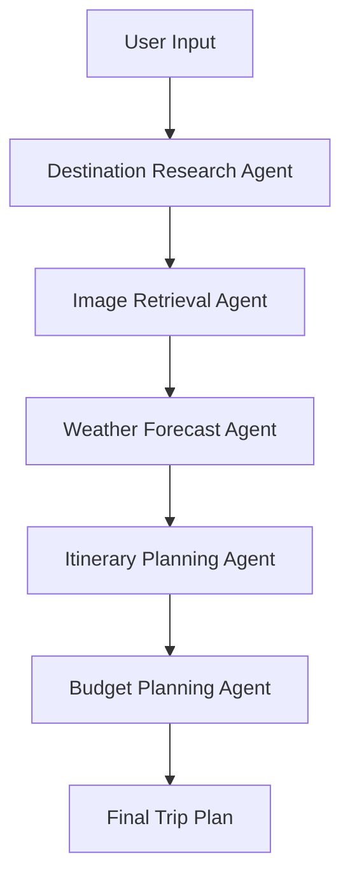

# 🗺️ AI Trip Planner - Multi-Agent System

A comprehensive AI-powered trip planning system built with LangGraph and multiple specialized AI agents. This system can research destinations, find tourist places, retrieve images, get weather forecasts, create detailed itineraries, and estimate budgets.

## 🌟 Features

### Multi-Agent Architecture
- **Destination Research Agent**: Searches for tourist places using SearchAPI and Google Maps
- **Image Retrieval Agent**: Fetches images for places using Serper API
- **Weather Forecast Agent**: Gets weather data using Open-Meteo API
- **Itinerary Planning Agent**: Creates detailed day-by-day itineraries
- **Budget Planning Agent**: Estimates costs and creates budget breakdowns

### Key Capabilities
- 🏛️ **Place Discovery**: Find tourist attractions, restaurants, parks, museums, and more
- 🖼️ **Image Retrieval**: Get high-quality images for each place
- 🌤️ **Weather Integration**: Real-time weather forecasts for your travel dates
- 📋 **Smart Itinerary**: AI-generated day-by-day plans based on preferences
- 💰 **Budget Estimation**: Cost breakdowns with destination-specific pricing
- 🎯 **Preference Matching**: Personalized recommendations based on interests
- 📱 **Multiple Interfaces**: CLI, Python API, and Jupyter notebook support

## 🚀 Quick Start

### 1. Installation

```bash
# Clone the repository
git clone <repository-url>
cd ai-trip-planner

# Create virtual environment with uv
uv venv
source .venv/bin/activate  # On Windows: .venv\Scripts\activate

# Install dependencies
uv pip install -r requirements.txt
```

### 2. Environment Setup

Create a `.env` file with your API keys:

```bash
# Required API Keys
GROQ_API_KEY=your_groq_api_key_here
SERPER_API_KEY=your_serper_api_key_here

# Optional API Keys
GOOGLE_API_KEY=your_google_api_key_here  # For Gemini models
OPENAI_API_KEY=your_openai_api_key_here  # For OpenAI models
```

### 3. Basic Usage

#### Python API
```python
from trip_planner import TripPlanner

# Initialize planner
planner = TripPlanner(llm_provider="groq")

# Plan a trip
trip_plan = planner.plan_trip(
    destination="New York City",
    duration_days=3,
    preferences=["museums", "parks", "restaurants"],
    group_size=2,
    budget=2000
)

# Print summary
planner.print_trip_summary(trip_plan)
```

#### Command Line Interface
```bash
# Basic trip planning
python scripts/trip_planner_cli.py "New York City" --duration 3 --budget 2000

# With preferences
python scripts/trip_planner_cli.py "Paris" --preferences museums,art,food --group-size 2

# With specific dates
python scripts/trip_planner_cli.py "Tokyo" --start-date 2024-06-01 --end-date 2024-06-05

# Stream planning process
python scripts/trip_planner_cli.py "London" --stream
```

## 🏗️ Architecture

### Multi-Agent Workflow



### Agent Responsibilities

1. **Destination Research Agent**
   - Searches for tourist places using SearchAPI
   - Filters results based on user preferences
   - Returns structured place data with ratings and descriptions

2. **Image Retrieval Agent**
   - Fetches high-quality images for each place
   - Prioritizes Wikipedia images for accuracy
   - Handles API rate limiting and errors gracefully

3. **Weather Forecast Agent**
   - Gets weather data using Open-Meteo API
   - Provides temperature, precipitation, and conditions
   - Integrates weather into itinerary planning

4. **Itinerary Planning Agent**
   - Creates day-by-day schedules
   - Distributes places based on preferences
   - Considers weather conditions and travel logistics

5. **Budget Planning Agent**
   - Estimates costs based on destination and preferences
   - Provides detailed budget breakdowns
   - Offers cost-saving recommendations

## 📊 Data Models

### Trip Planning State
```python
class TripPlanningState(TypedDict):
    # User inputs
    destination: str
    start_date: Optional[date]
    end_date: Optional[date]
    duration_days: Optional[int]
    budget: Optional[float]
    preferences: List[str]
    group_size: Optional[int]
    
    # Research data
    places: List[Place]
    place_images: Dict[str, str]
    weather_forecast: List[WeatherData]
    
    # Planning results
    itinerary: List[ItineraryDay]
    budget_breakdown: Optional[Dict[str, float]]
    recommendations: List[str]
```

### Place Model
```python
class Place(BaseModel):
    name: str
    description: str
    rating: Optional[float]
    address: Optional[str]
    category: Optional[str]
    image_url: Optional[str]
    coordinates: Optional[Dict[str, float]]
```

## 🔧 Configuration

### LLM Providers
- **Groq**: Fast inference with Llama models
- **Google**: Gemini models with advanced reasoning
- **OpenAI**: GPT models (optional)

### Search APIs
- **SearchAPI**: Google Maps integration for place discovery
- **Serper**: Image search and web data

### Weather APIs
- **Open-Meteo**: Free weather data (no API key required)

## 📝 Examples

### Example 1: Museum-Focused Trip
```python
trip_plan = planner.plan_trip(
    destination="Paris",
    duration_days=4,
    preferences=["museums", "art", "history"],
    group_size=1,
    budget=1500
)
```

### Example 2: Budget Travel
```python
trip_plan = planner.plan_trip(
    destination="Prague",
    duration_days=3,
    preferences=["budget", "architecture", "food"],
    group_size=2,
    budget=600
)
```

### Example 3: Luxury Experience
```python
trip_plan = planner.plan_trip(
    destination="Dubai",
    duration_days=5,
    preferences=["luxury", "shopping", "fine dining"],
    group_size=2,
    budget=5000
)
```

## 🛠️ Development

### Project Structure
```
trip_planner/
├── __init__.py
├── main.py                 # Main interface
├── state.py               # Data models
├── agents/                # AI agents
│   ├── destination_research.py
│   ├── image_retrieval.py
│   ├── weather_forecast.py
│   ├── itinerary_planning.py
│   └── budget_planning.py
├── workflows/             # LangGraph workflows
│   └── trip_planning_workflow.py
└── examples/              # Usage examples
    └── complete_trip_planner.py
```

### Adding New Agents
1. Create a new agent class in `trip_planner/agents/`
2. Implement the required methods
3. Add the agent to the workflow in `trip_planning_workflow.py`
4. Update the state model if needed

### Testing
```bash
# Run tests
python -m pytest tests/

# Run specific test
python -m pytest tests/test_agents.py
```

## 🌍 Supported Destinations

The system works with any destination worldwide, with special optimizations for:
- Major cities (New York, London, Paris, Tokyo, etc.)
- Countries and regions
- Tourist destinations
- Off-the-beaten-path locations

## 🔒 API Keys Required

### Required
- **GROQ_API_KEY**: For LLM inference
- **SERPER_API_KEY**: For image search

### Optional
- **GOOGLE_API_KEY**: For Gemini models
- **OPENAI_API_KEY**: For GPT models
- **SEARCHAPI_API_KEY**: Alternative search provider

## 📈 Performance

- **Speed**: Fast inference with Groq (sub-second responses)
- **Accuracy**: High-quality results with multiple validation layers
- **Reliability**: Error handling and fallback mechanisms
- **Scalability**: Designed for concurrent requests

## 🤝 Contributing

1. Fork the repository
2. Create a feature branch
3. Make your changes
4. Add tests
5. Submit a pull request

## 📄 License

This project is licensed under the MIT License - see the LICENSE file for details.

## 🙏 Acknowledgments

- LangChain for the agent framework
- LangGraph for workflow orchestration
- Groq for fast LLM inference
- Open-Meteo for free weather data
- SearchAPI and Serper for search capabilities

## 📞 Support

For questions, issues, or contributions:
- Create an issue on GitHub
- Check the documentation
- Review the examples

---

**Happy Travel Planning! 🗺️✈️**
